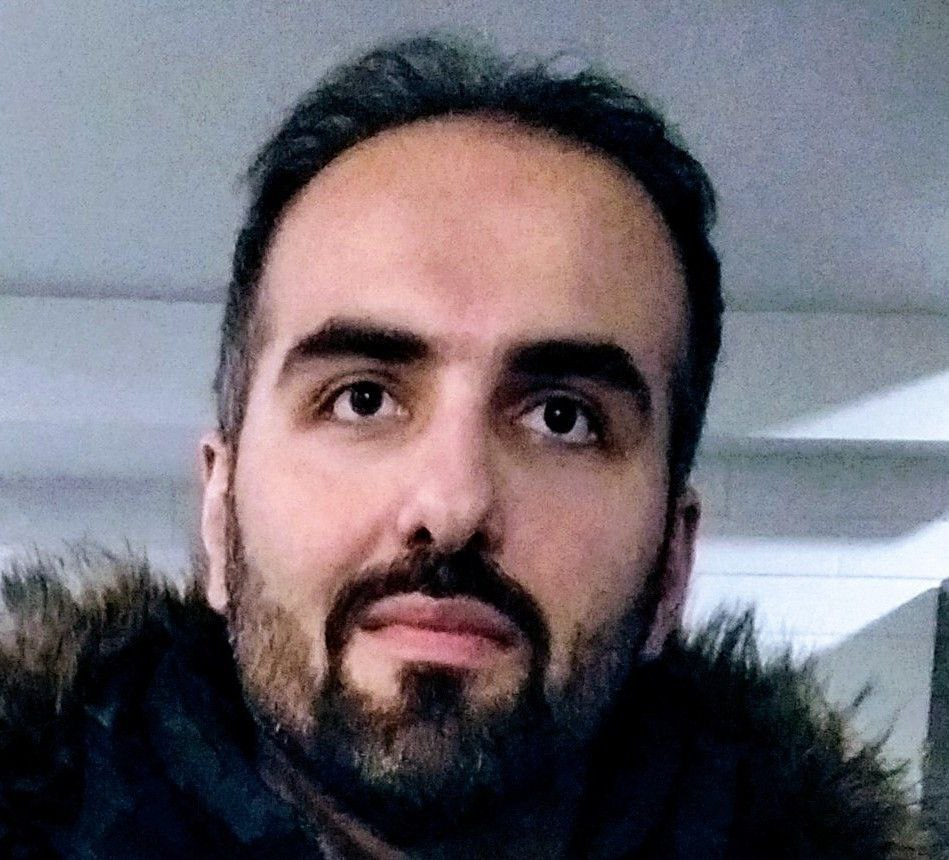

<!DOCTYPE html>
<html lang="en">
<head>
  <meta charset="UTF-8">
  <meta name="viewport" content="width=device-width, initial-scale=1.0">
  <title>Ashkan Amirnia</title>
  
</head>
<body>
  

    <h1>Welcome / خوش آمدید</h1>
 
  

     <!-- Replace 'profile.jpg' with your profile picture path -->
   

 

    
    

      <h3>About Me</h3>
      
        During my teenage years, I discovered a magazine focused on science and technology called Danestaniha. After reading a few editions, I became a fan of the magazine. It not only provided entertainment but also ignited my interest in the world of science and technology. This fascination led me to pursue a degree in electronic engineering at the university, a field closely associated with technology. In my final year of undergraduate studies, I was introduced to Artificial Intelligence (AI), and my interest in this field deepened. Motivated by this passion, I pursued a Master's degree in AI, specializing in real-time computer vision, at Sharif University of Technology. Throughout my years of study, I successfully completed various courses related to AI, including image processing, machine learning, machine vision, computer vision in intelligent environments, parallel programming, data mining, and advanced statistical analysis. After obtaining my master's degree, I garnered valuable experience by working as a machine learning engineer and consultant for several years, contributing to diverse industrial projects. Since the summer of 2022, I have been pursuing my Ph.D. under the supervision of Professor Samira Kivanpour. My research focuses on developing machine learning algorithms for human-robot collaboration disassembly planning. My objective is to develop autonomous models capable of making real-time decisions based on dynamic conditions. In essence, tackling machine learning challenges is not just a job for me; it is a hobby that I truly enjoy.
      
    

    

    

      <h3>My Skills</h3>
      <ul>
        <li>Applied machine learning</li>
        <li>Real-time decision-making</li>
        <li>Reinforcement Learning application in industry</li>
        <li>Robotic/cobotic manufacturing</li>
        <li>Computer vision</li>
        <li>Recommender systems and personalization</li>
      </ul>
      

      
      <h3>Education</h3>
      <ul>
        <li>PhD in Polytechnique montreal  2022-present</li>
        <li>Master of Engineering in Sharif university  2016-2019</li>
        <li>Bachelor of Science in Shahid chamran university  2012-2016</li>
      </ul>
      

    

    
    <h3>Contact Information</h3>
    
You can reach me at: <a href="mailto:ashkan.amirnia@polymtl.ca">ashkan.amirnia@polymtl.ca</a>

  

</body>
</html>
