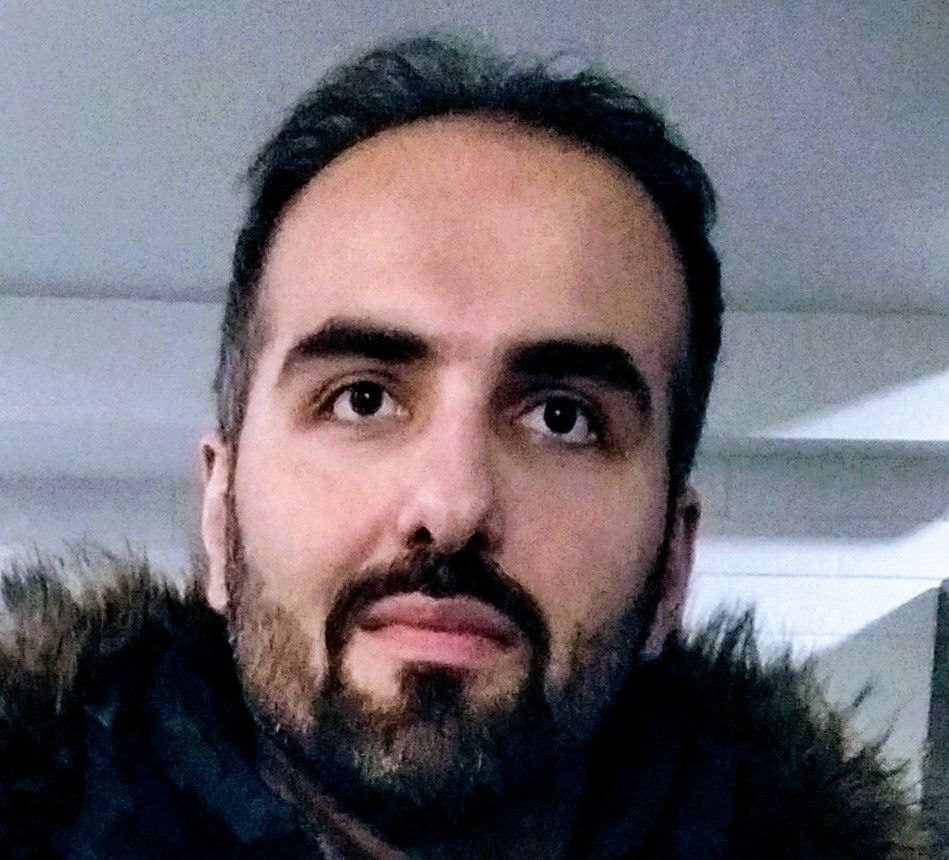

<html lang="en">
<head>
  <meta charset="UTF-8">
  <meta name="viewport" content="width=device-width, initial-scale=1.0">
  <title>Ashkan Amirnia</title>
  
</head>
<body>
  

    <h1>Welcome / خوش آمدید</h1>
  

 
  

    

    <!-- دکمه‌های تب‌ها -->
    

      <button class="tab-button active" onclick="openTab(event, 'about')">About Me</button>
      <button class="tab-button" onclick="openTab(event, 'skills')">Skills</button>
      <button class="tab-button" onclick="openTab(event, 'hobbies')">Hobbies</button>
      <button class="tab-button" onclick="openTab(event, 'education')">Education</button>
      <button class="tab-button" onclick="openTab(event, 'notes')">Notes</button>    
    

    <!-- محتوای تب اول: About Me -->
    

      

        <h3>About Me</h3>
        
During my teenage years, I discovered a magazine focused on science and technology called Danestaniha. After reading a few editions, I became a fan of the magazine. It not only provided entertainment but also ignited my interest in the world of science and technology. This fascination led me to pursue a degree in electronic engineering at the university, a field closely associated with technology. In my final year of undergraduate studies, I was introduced to Artificial Intelligence (AI), and my interest in this field deepened. Motivated by this passion, I pursued a Master's degree in AI, specializing in real-time computer vision, at Sharif University of Technology. Throughout my years of study, I successfully completed various courses related to AI, including image processing, machine learning, machine vision, computer vision in intelligent environments, parallel programming, data mining, and advanced statistical analysis. After obtaining my master's degree, I garnered valuable experience by working as a machine learning engineer and consultant for several years, contributing to diverse industrial projects. Since the summer of 2022, I have been pursuing my Ph.D. under the supervision of Professor Samira Kivanpour. My research focuses on developing machine learning algorithms for human-robot collaboration disassembly planning. My objective is to develop autonomous models capable of making real-time decisions based on dynamic conditions. In essence, tackling machine learning challenges is not just a job for me; it is a hobby that I truly enjoy.

      

    

    <!-- محتوای تب دوم: Skills -->
    

      

        <h3>My Skills</h3>
        <ul>
          <li>Applied machine learning</li>
          <li>Reinforcement learning</li>
          <li>Production planning</li>
          <li>Computer vision</li>
          <li>Recommender systems and personalization</li>
          <li>Teamwork</li>
          <li>Project management</li>
          <li>Storytelling</li>
        </ul>
        
      

    

    <!-- محتوای تب چهارم: Hobbies -->
    

      

        <h3>Hobbies</h3>
        <ul>
          <li>Painting and drawing</li>
          <li>Taking long walks in nature</li>
          <li>Reading Novels and persian poem books</li>
          <li>Watching movies, listening to music</li>
   
        </ul>
      

    

    <!-- محتوای تب سوم: Education -->
    

      

        <h3>Education</h3>
        <ul>
          <li>PhD in Polytechnique montreal 2022-2025</li>
          <li>Master of Engineering in Sharif university 2016-2019</li>
          <li>Bachelor of Science in Shahid chamran university 2012-2016</li>
        </ul>
      

    

    <!-- محتوای تب دوم: Notes -->
    

      

       
        <ul>
         مقصد من رفتن است، با نرسیدن خوشم / هر که به مقصد خوش است، مانده ی بن بست هاست

        </ul>
        
      

    

    

    

    
    <!-- بخش تماس در انتهای صفحه ثابت می‌ماند -->
    <h3>Contact Information</h3>
    
You can reach me at: <a href="mailto:ashkan.amirnia@polymtl.ca" style="color: #00e6ff;">ashkan.amirnia@polymtl.ca</a>

  

  <!-- اسکریپت کوتاه جاوااسکریپت برای جابجایی بین تب‌ها -->
  
</body>
</html>
